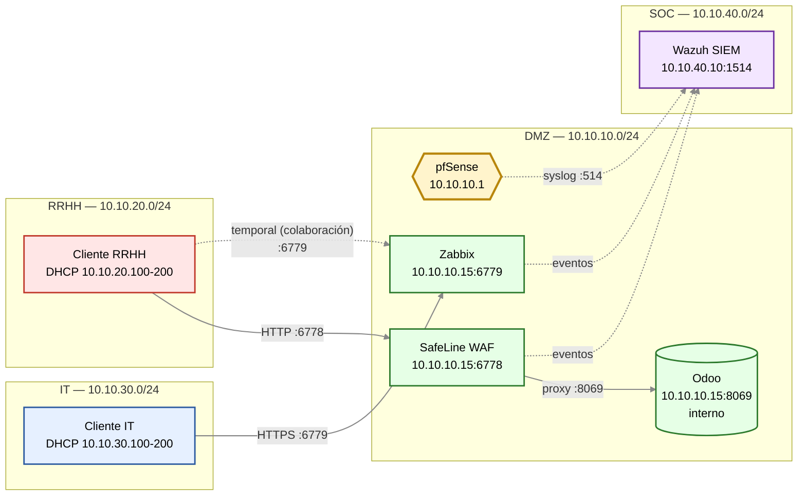

# Arquitectura del entorno

Entorno de laboratorio segmentado con **pfSense** como firewall perimetral,
**Odoo** protegido por **SafeLine** (WAF), **Zabbix** para monitoreo y
**Wazuh** como SIEM.

## Topología

## Notas de diseño

- **Odoo (:8069)** solo es accesible desde SafeLine. Nunca se expone directo a RRHH ni a IT.
- **SafeLine (:6778)** es el único punto de entrada a la app web de RRHH.
- **Zabbix (:6779)** solo accesible desde IT. La línea punteada hacia RRHH es la **regla temporal de colaboración** que se abre en vivo durante la demo.
- **Wazuh (SOC)** recibe logs de tres fuentes: pfSense (syslog 514), SafeLine y Zabbix.
- Las flechas **punteadas** representan tráfico de logs o reglas temporales.

## Matriz de puertos

| Origen | Destino | Puerto | Acción | Propósito |
|---|---|---|---|---|
| RRHH | SafeLine | 6778 | Allow | Acceso a Odoo vía WAF |
| IT | Zabbix | 6779 | Allow | Monitoreo |
| SafeLine | Odoo | 8069 | Allow | Proxy interno |
| pfSense | Wazuh | 514/UDP | Allow | Logs del firewall |
| RRHH | Zabbix | 6779 | **Deny** (temporal Allow) | Caso de colaboración |
| * | Odoo:8069 | — | **Deny** | Nunca expuesto directo |
